# Smart Gate & Merchant RFID Payment System

 In today's fast-paced world, traditional cash payments and manual ticket checking at gates, parking lots, and merchants create unnecessary delays and long queues. This project aims to solve that problem by implementing a reliable, contactless RFID "Tap & Go" payment system. By integrating an ESP32 microcontroller with a secure Node.js backend and a PostgreSQL database, this system provides a seamless, secure, and modern payment experience that benefits both businesses and customers.
 
 [Watch on YouTube Shorts](https://www.youtube.com/shorts/lGFEGifkuyw)

## Table of Contents
1. [Benefits of RFID Card Payment for Merchants](#1-benefits-of-rfid-card-payment-for-merchants)
2. [What is RFID Technology and its Frequency?](#2-what-is-rfid-technology-and-its-frequency)
3. [System Architecture & Design](#3-system-architecture--design)
   - [A. Overall System Architecture](#a-overall-system-architecture)
   - [B. Data Flow (Sequence Diagram)](#b-data-flow-sequence-diagram)
   - [C. ESP32 to RC522 Wiring & Pinout](#c-esp32-to-rc522-wiring--pinout)
4. [Implementation Steps & Testing Evidence](#4-implementation-steps--testing-evidence)
   - [Phase 1: Docker & Database Setup](#phase-1-docker--database-setup)
   - [Phase 2: Backend API Testing](#phase-2-backend-api-testing)
   - [Phase 3: Microcontroller (ESP32) Programming](#phase-3-microcontroller-esp32-programming)
   - [Phase 4: Physical Hardware Testing](#phase-4-physical-hardware-testing)

---

## 1. Benefits of RFID Card Payment for Merchants
An RFID card payment system offers high **business value**, especially for quick micro-transactions at merchants or smart gates:
* **Speed (Tap & Go):** Payments are completed in less than a second. This eliminates long queues caused by cash payments.
* **Security & Accuracy:** There is no need to calculate change, which prevents human error and cashier fraud.
* **Resilience to Network Failures (Idempotency Key):** The system uses an *Idempotency Key* protection. This prevents double-charges if a customer accidentally taps the card multiple times or if the internet times out. If the device fails to open the gate, the system automatically processes a *Refund* so the customer doesn't lose money.
* **Real-time Tracking:** Every card tap is automatically saved in the database (PostgreSQL), allowing merchants to monitor revenue, busy hours, and customer behavior in real-time.
* **Customer Experience:** It provides a modern, hygienic (contactless), and premium experience.

## 2. What is RFID Technology and its Frequency?
**RFID (Radio Frequency Identification)** is a technology that uses radio frequency electromagnetic fields to identify and track tags (cards) brought near a reader device.
* **Frequency:** This system uses the **RC522** reader module which operates at **High Frequency (HF) 13.56 MHz**.
* **How It Works:** The RC522 module constantly emits electromagnetic waves. When a passive RFID card (without a battery) enters this field, the induction antenna inside the card absorbs the energy and sends back a unique series of numbers called a *Unique Identifier* (UID). This UID acts as the user's account ID.

---

## 3. System Architecture & Design

### A. Overall System Architecture
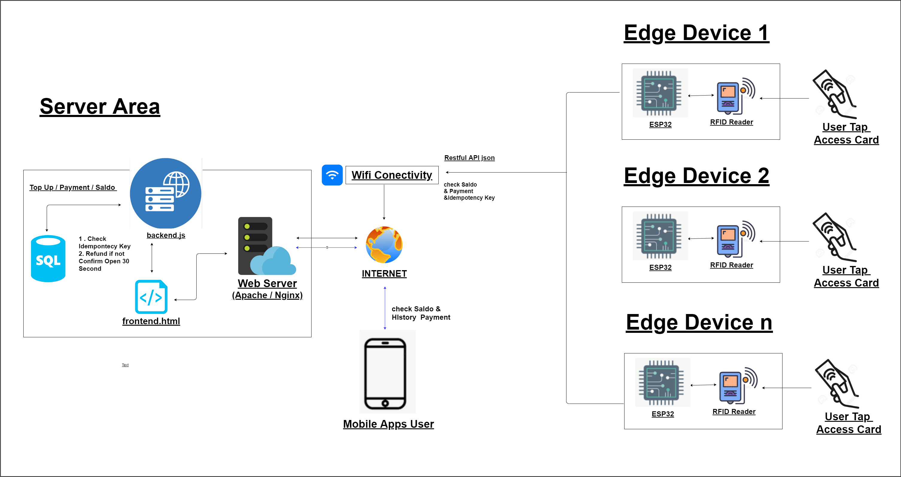
**Main Architecture Components:**
1. **IoT Node (ESP32 + RC522 + Servo):** The physical frontline. It reads the card's UID, sends it to the server via WiFi, and opens the barrier (servo) if the response is successful.
2. **Nginx Reverse Proxy (Frontend):** Serves the static web UI (HTML/CSS/JS) to check user balance/history, and internally routes (proxy-passes) `/api` requests to avoid CORS issues.
3. **Node.js Express (Backend):** The main business logic engine. It checks balance availability, deducts funds, logs transactions, and returns access authorization.
4. **PostgreSQL Database:** Safely stores master data (users, cards, merchants) and transaction records consistently (ACID compliant).

### B. Data Flow (Sequence Diagram)
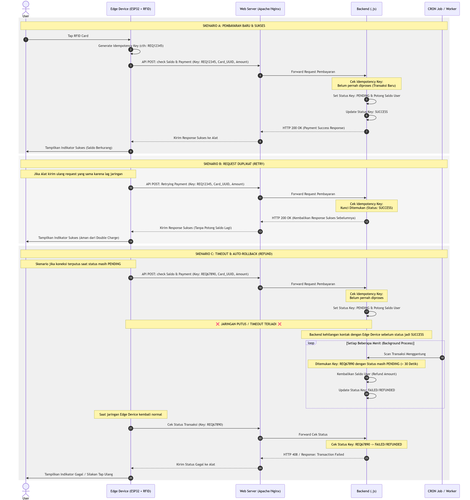
**Flow Explanation:**
1. The user taps the physical card on the reader.
2. The ESP32 packages the UID and an *idempotency key*, then sends an HTTP POST Request (`/api/pay`) to the Backend Server.
3. The Backend coordinates with PostgreSQL to ensure the card is registered, valid, and has enough balance.
4. The Backend saves the initial transaction status in the database and responds "SUCCESS" to the ESP32.
5. After receiving the HTTP 200 (Success) response, the ESP32 rotates the Servo motor to open the physical gate.

### C. ESP32 to RC522 Wiring & Pinout
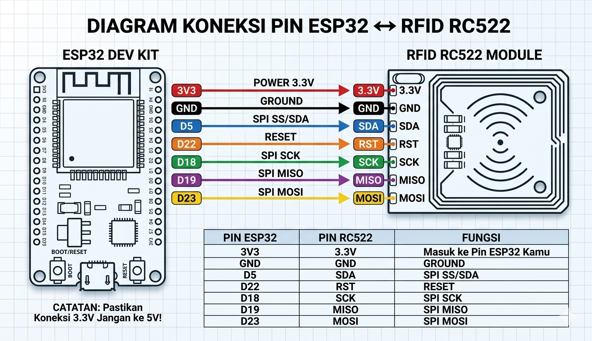
This pinout diagram is extremely critical. The RC522 module operates at a **3.3V** logic level. 
* **You must** connect the module's 3.3V pin to the ESP32's 3V3 pin (never connect it to 5V or the module will burn). 
* The Reset (RST) pin goes to D22, and the SPI pins (SDA, SCK, MOSI, MISO) follow the ESP32 VSPI standard. 
Wiring mistakes are the most common reason the RFID module fails to read (indicated by a Firmware Version 0x00 error in the Serial Monitor).

---

## 4. Implementation Steps & Testing Evidence

Below is a step-by-step documentation of the system's creation, from initial setup to successful execution (ordered by screenshot evidence).

### Phase 1: Docker & Database Setup
The first step is to run the local infrastructure (Database, Backend, Frontend) using Docker Compose, and ensure the database tables are created.

**1. Running Docker Compose**
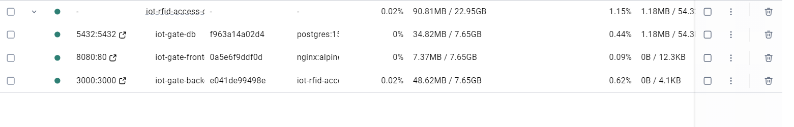
*(All service containers: db, frontend, backend successfully created, running, and neatly isolated).*

**2. Database Structure & ERD**
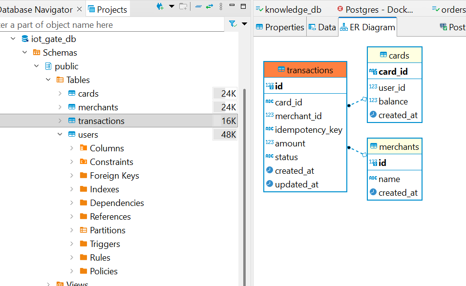
*(Verification through a database client confirms all main tables are generated perfectly and ready to hold data).*

### Phase 2: Backend API Testing
Before connecting physical devices, the HTTP REST API functionality is validated independently using Postman.

**3. Payment API Test (Pay)**
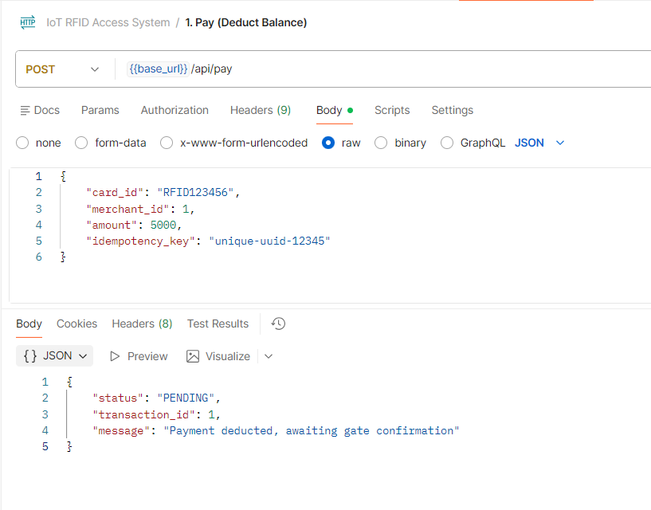
*(Verifying the `/api/pay` endpoint correctly deducts user balance virtually and returns a transaction ID).*

**4. Confirmation API Test (Confirm)**
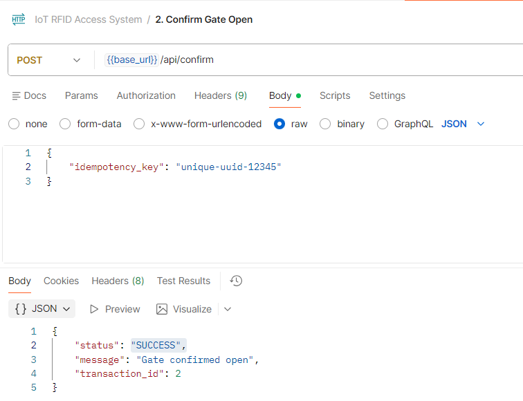
*(The `/api/confirm` endpoint is prepared in case a second phase is needed to confirm the physical gate was successfully passed).*

**5. Transaction History API Test (History)**
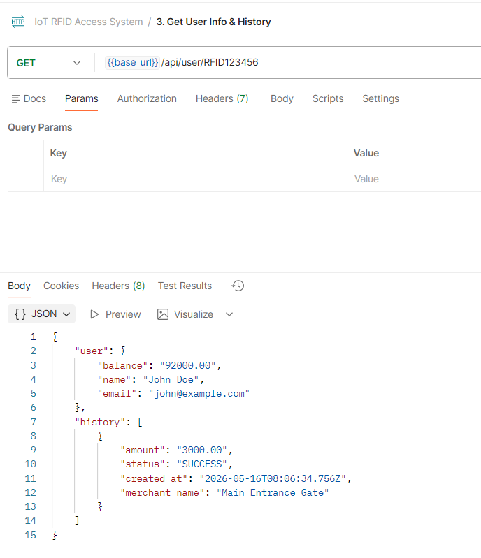
*(Ensuring the system can extract and present history data in real-time for the frontend).*

**6. Validating Transaction Storage in Database**
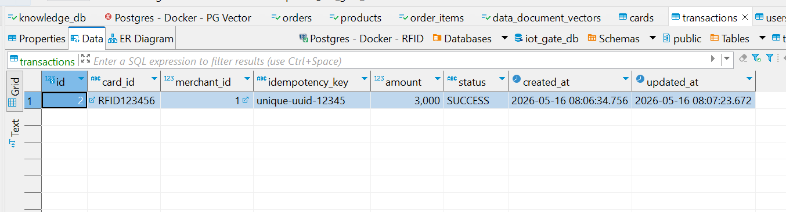
*(Proof that test transaction data from Postman is successfully recorded in the PostgreSQL `transactions` table).*

**7. Displaying Data on Frontend Dashboard**
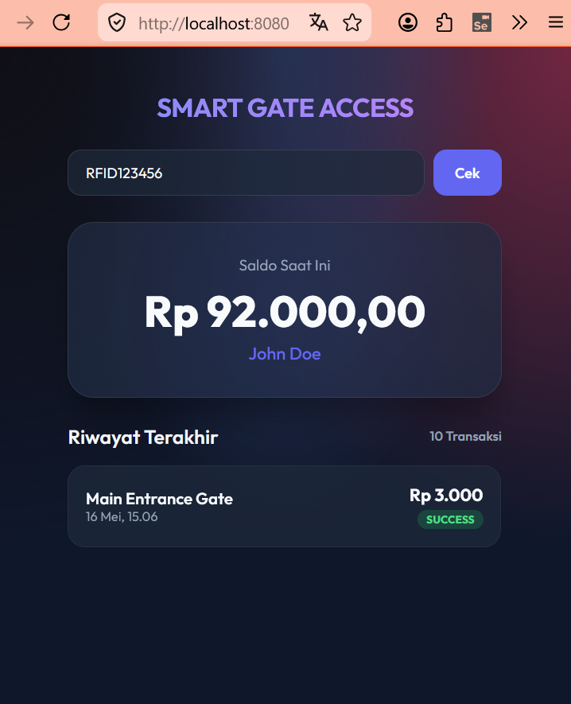
*(The customer HTML/CSS Web interface successfully calls the API to aesthetically display remaining balance).*

### Phase 3: Microcontroller (ESP32) Programming
Once the server is ready, the focus shifts to programming the physical hardware's flash memory using the Arduino IDE.

**8. Microcontroller Physical Pin Mapping**
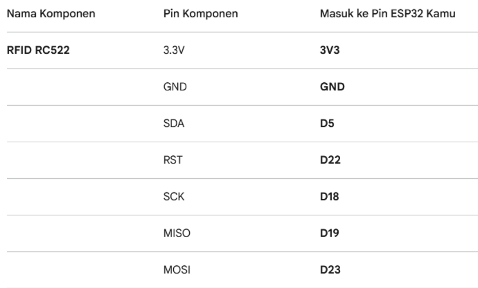
*(Defining `#define` macros in the C++ source code referencing the device's SPI pin diagram).*

**9. Installing MFRC522 Library**
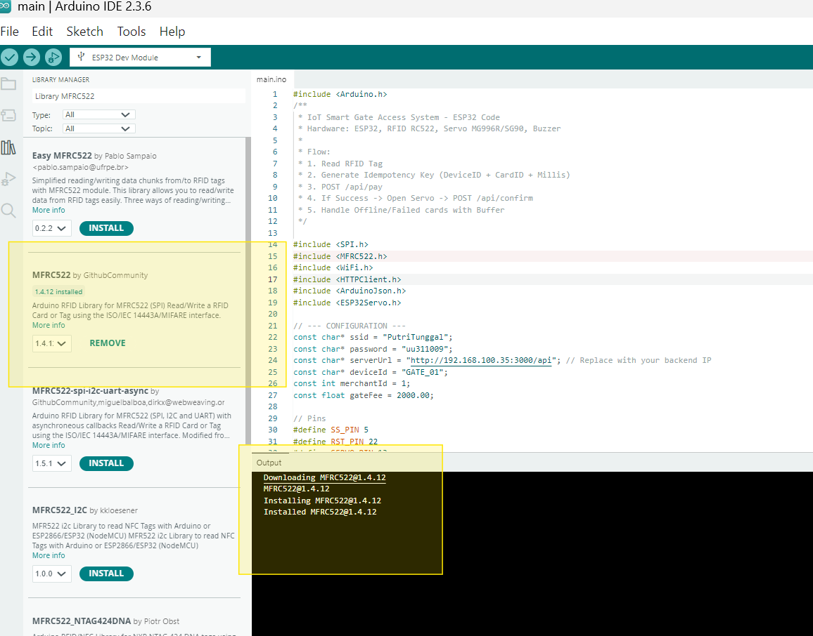
*(Downloading the "MFRC522 by GithubCommunity/Miguel Balboa" library to translate the RC522 SPI signal bits).*

**10. Installing ESP32Servo Library**
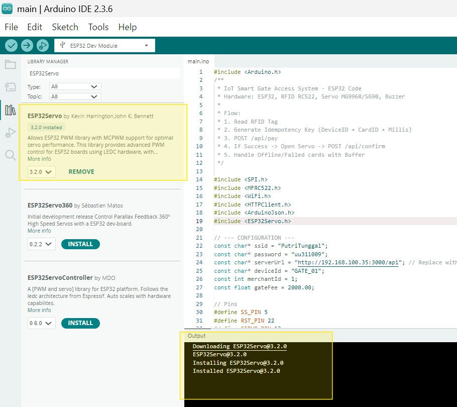
*(The default Arduino Servo library is incompatible with ESP32 hardware timers, making this specific library installation mandatory).*

**11. Configuring ESP32 Board Module**
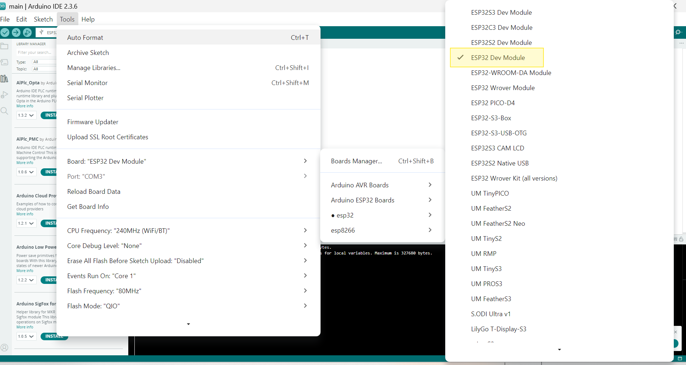
*(Selecting the 'DOIT ESP32 DEVKIT V1' profile in Arduino IDE so the compiler targets the correct architecture).*

**12. Compile & Upload Process to ESP32**
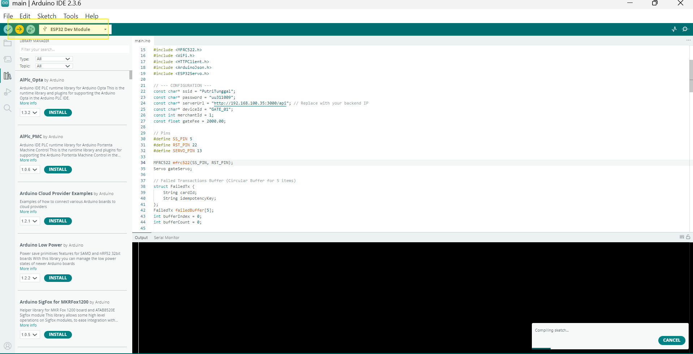
*(After coding, the program is converted into machine code (binary) and injected into the ESP32 Flash memory).*

**13. Configuring Serial Monitor Baud Rate**
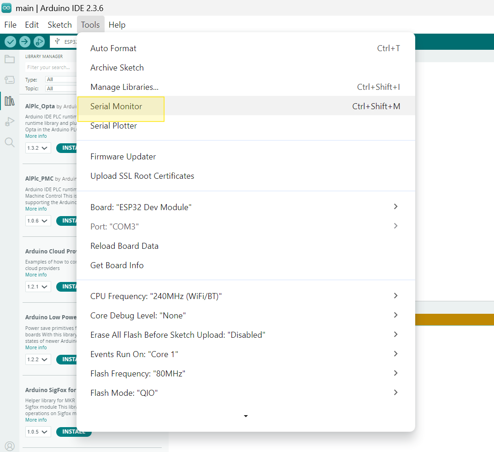
*(Setting up the debugging communication line. Changed to `115200` bps so the ESP32 output text is human-readable without artifacts).*

### Phase 4: Physical Hardware Testing
This is the crucial final phase of integrating the entire system by tapping a physical white card directly against the PCB antenna.

**14. Standby Condition (No Card)**
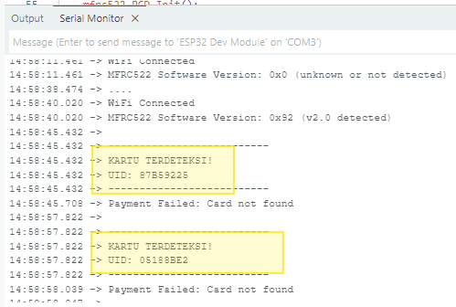
*(The microcontroller system powers on successfully. The serial log is empty, emitting antenna waves waiting for induction).*

**15. Tapping the RFID Card**
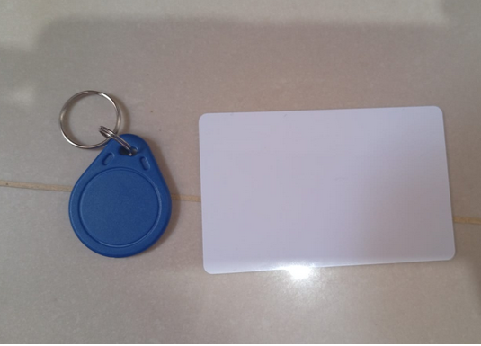
*(The tapped white card successfully provides an induction response, printing the hexadecimal UID string to the monitor).*

**16. Rejection of Unregistered Card**
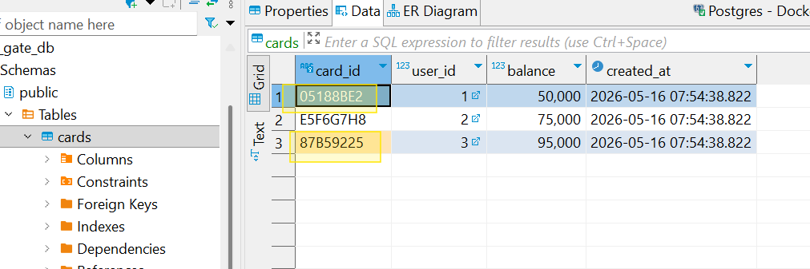
*(Despite a successful tap, the Node.js Backend smartly rejects the request and returns a JSON error message because the card is not registered in the database).*

**17. Finalization: Successful Payment and Access!**
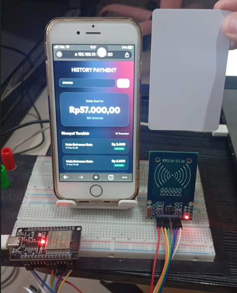
*(Testing a card that has balance loaded. The payload is sent to the Backend, processed, and returns a "Payment Success" status, triggering the physical servo gate to rotate and let the user pass).*
